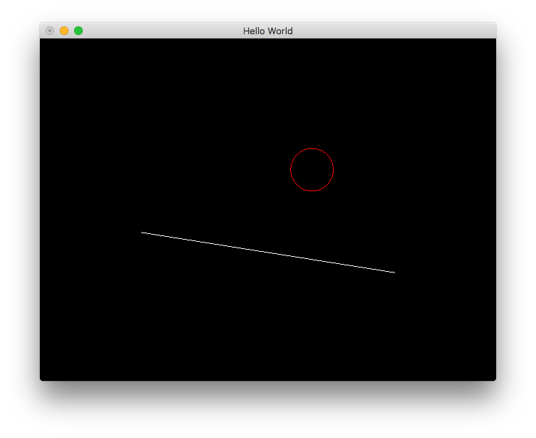
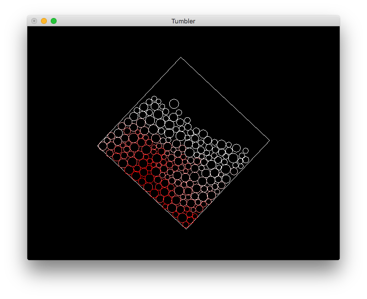
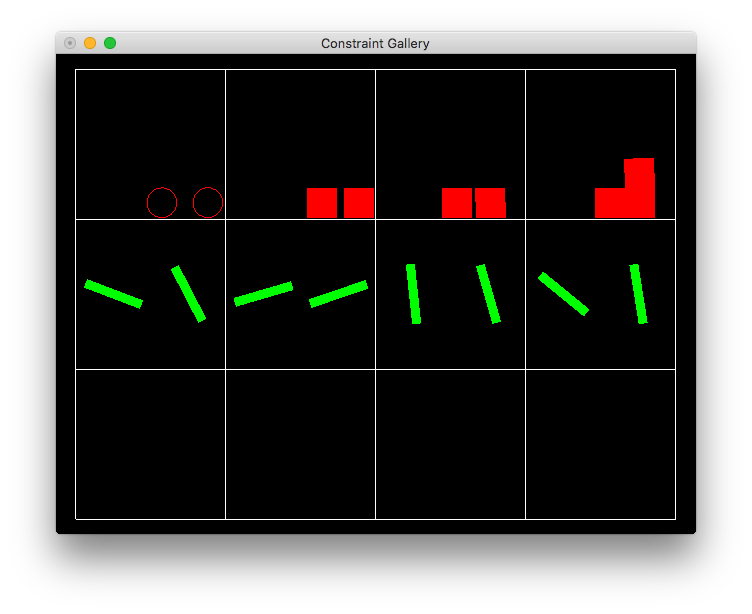

# apecs-physics

2D physics library for apecs.
Uses the [Chipmunk](https://github.com/slembcke/Chipmunk2D) physics engine.
The [apecs-physics-gloss](../apecs-physics-gloss) package provides a simple optional [gloss](https://github.com/benl23x5/gloss)-based renderer.

Feel free to create an issue or PR for suggestions/questions/requests/critiques/spelling fixes/etc.
See [TODO.md](TODO.md) for suggestions if you want to help out with the code.

The examples directory contains a number of examples, each can be run with `stack build && stack <examplename>`:

### helloworld


```haskell
makeWorld "World" [''Physics, ''BodyPicture, ''Camera]
```
Generate a world.
The `Physics` component adds a physics space to the world.
The `BodyPicture` contains a gloss `Picture`, which the renderer will match to the `Body`'s position and orientation.
The `Camera` component tracks a camera position and zoom factor.

```haskell
initialize = do
  set global ( Camera (V2 0 1) 60
             , earthGravity )
```
Globals can be set with any entity argument, `global` is just an alias for -1.
`earthGravity = V2 0 (-9.81)`, normal earth surface gravity if we assume normal MKS units.
Note that the positive y-axis points upwards.

```haskell
  let ballShape = cCircle 0.5
  newEntity ( DynamicBody
            , Shape ballShape
            , Position (V2 0 3)
            , Density 1
            , Elasticity 0.9
            , BodyPicture . color red . toPicture $ ballShape )
```
Still in the initialize function, here we see our first object being instantiated.
The type of ballShape is `Convex`, the apecs-physics format for shapes.
`Convex` is a convex polygon, consisting of a number of vertices and a radius.
In the case of a circle, the polygon consists of a single point with a non-zero radius.
Both Chipmunk and gloss only support convex polygons, `Convex` is used to give them a common interface.

A `DynamicBody` is one of three types of bodies.
It is a normal body, fully affected by physical forces.
The elasticity of a collision is the product of the elasticities of the colliding shapes.

The final line shows how to do rendering.
`BodyPicture` expects a gloss `Picture`, in this case we derive one from `ballShape :: Convex` using `toPicture`.
`color red` comes from gloss, and is just one of the many `Picture` manipulation functions.
Alternatively, you can use a `Bitmap` to use actual sprites.

```haskell
  let lineShape = hLine 6
  newEntity ( StaticBody
            , Angle (-pi/20)
            , Shape lineShape
            , Elasticity 0.9
            , BodyPicture . color white . toPicture $ lineShape )
```
Static bodies are not affected by physics, and generally rarely move.
They are equivalent to bodies with infinite mass and moment, and zero velocity.
Changing their position triggers an explicit rehash of their shapes, wish is relatively expensive.

```haskell
main = do
  w <- initWorld
  runSystem initialize w
  defaultSimulate w
```
`defaultSimulate` is a convenience wrapper around gloss' `simulateIO`.
You can find its definition in `Apecs.Physics.Gloss`, in case you want to change the rendering behavior.

### tumbler


```haskell
initialize :: System World ()
initialize = do
  set global ( Camera 0 50
             , earthGravity )

  let sides = toEdges $ cRectangle 5
  tumbler <- newEntity ( KinematicBody
                       , AngularVelocity (-1)
                       , BodyPicture . color white . foldMap toPicture $ sides )
```
As previously stated, both Chipmunk and gloss exclusively have _convex_ polygon primitives.
Our tumbler, however, is obiously not convex.
Fortunately, composing shapes is really easy.
We use `toEdges` to turn a rectangle into an outline of one, and use `foldMap` to make a composite `Picture`.

A `KinematicBody` is halfway between a `DynamicBody` and a `StaticBody`.
It can have an (angular) velocity, but will not respond to forces.
It can be used for e.g. moving platforms, or in this case.
Note that we did not add any shapes to the tumbler yet.

```haskell
  forM_ sides $ \line -> newEntity (ShapeExtend (cast tumbler) $ setRadius 0.05 line)
```
The time has come to talk about the destinction between shapes and bodies.
A body can have multiple shapes.
Shapes belonging to the same body _cannot move relative to one another_, i.e. a body is a fixture for multiple shapes.
When using the normal `Shape` data constructor to add a shape to a body, we actually create two Chipmunk structs; one for the body, and one for the shape, even though they are addressed by the same entity in apecs.

When we want to add multiple shapes to a body, however, we need to make new entities for each individual shape.
The reason for this is that this way, we can still easily change the properties of each individual shape.
`Shape` actually just represents a special case of `ShapeExtend`, the case in which the body has the same entity as the shape.

When you use a tuple of components in apecs, they are added in the order you list them in the tuple.
This is important to realize, as _adding a shape to an entity wihout a body is a noop_.
Always make sure you first add a body, and then the shapes.
This also comes up when e.g. setting a shape's properties: you can only set a shape's `Mass` or `Density` when there is a shape in the first place.
If you don't, you will get a runtime error about simulating zero-mass `DynamicBodies`.

```haskell
  replicateM_ 200 $ do
    x <- liftIO$ randomRIO (-2, 2)
    y <- liftIO$ randomRIO (-2, 2)
    r <- liftIO$ randomRIO (0.1, 0.2)
    let ballshape = cCircle r
    let c = (realToFrac x+2)/3
    newEntity ( DynamicBody
              , Position (V2 x y)
              , Shape ballshape
              , BodyPicture . color (makeColor 1 c c 1) . toPicture $ ballshape
              , Density 1 )

  return ()
```
Finally, we randomly add a bunch of balls.

### constraints


The final example is a gallery of (some of) the available constraints.
Drag shapes around with the left mouse button, create a new box with the right.

This example is too large to fully include here, but if you have made it this far, I recommend looking at the source.
Aside from demonstrating constraints, queries and interaction it also contains some neat tricks like:
```haskell
let rubber = (Friction 0.5, Elasticity 0.5, Density 1)
newEntity ( DynamicBody
          , someShape
          , rubber )
```
Nesting tuples creates composable and reusable pieces of configuration (this is an apecs thing, not an apecs-physics thing).
This can also be useful if you find yourself needing bigger tuples than the current maximum.

Constraints are a lot like shapes, but instead of having one associated `Body`, they have two.
It also comes in the varieties `Constraint` and `ConstraintExtend`.

Dragging an object with the mouse is also done using a constraint.
The mouse position actually controls the position of a static body without shapes, and we use a PinJoint to attach whatever we are dragging to it.
